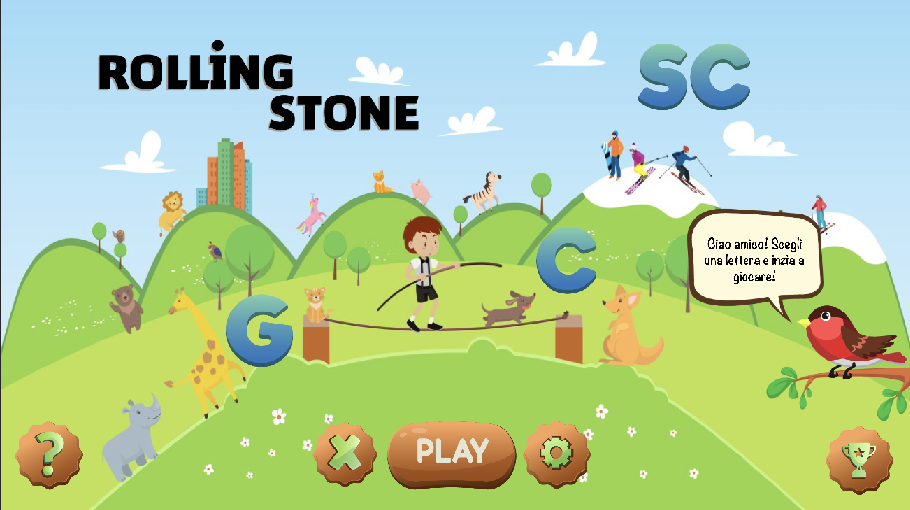
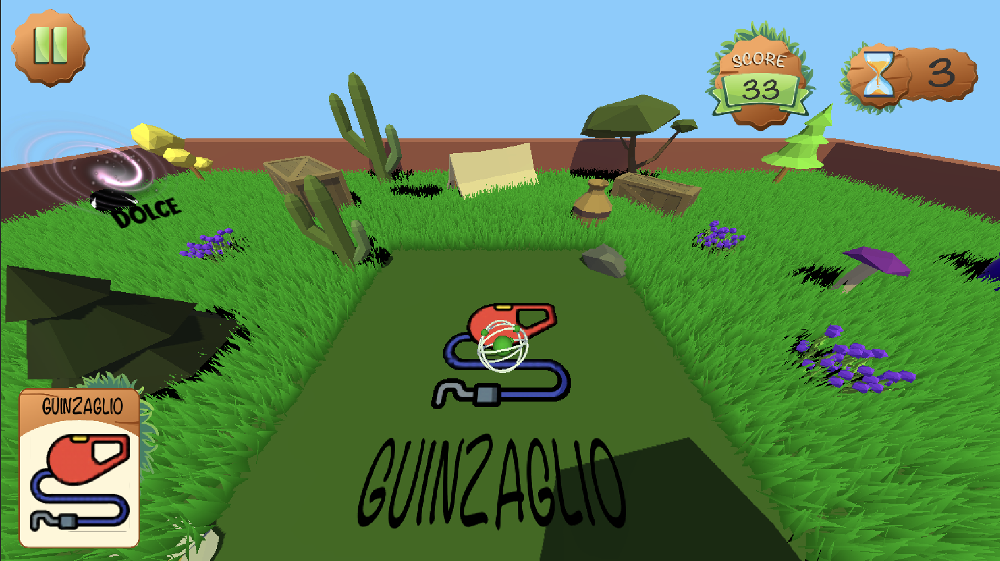

# Rolling-stone-eHealthGame

ITA

Rolling Stone è un gioco realizzato con Unity che permette ai bambini di rafforzare la capacità di discriminare tra suoni deboli e duri per le lettere C e G, e suoni SC. Inoltre, questo gioco può essere anche un utile strumento per studiare il comportamento dei bambini grazie ai dati raccolti durante il processo decisionale svolto durante ogni round.

ENG

Rolling Stone is a game made with Unity that allows children to strengthen the ability to discriminate between soft and hard sounds for the letters C and G, and SC sounds. Moreover, this game can also be a useful tool to study kids’ behavior thanks to the data collected during the decision-making process carried out during each round.

